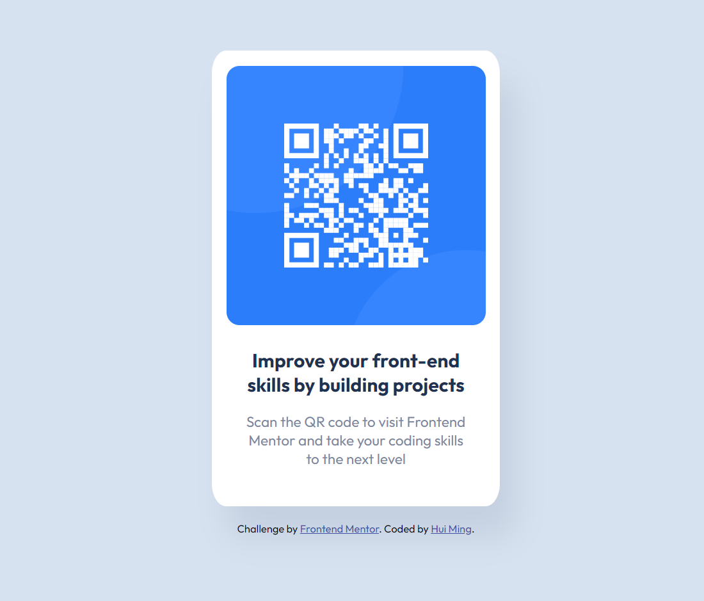

# Frontend Mentor - QR code component solution

This is a solution to the [QR code component challenge on Frontend Mentor](https://www.frontendmentor.io/challenges/qr-code-component-iux_sIO_H). Frontend Mentor challenges help you improve your coding skills by building realistic projects. 

## Table of contents

- [Overview](#overview)
  - [Screenshot](#screenshot)
  - [Links](#links)
- [My process](#my-process)
  - [Time taken](#time-taken)
  - [Built with](#built-with)
  - [What I learned](#what-i-learned)
  - [Useful resources](#useful-resources)
- [Author](#author)

## Overview

### Screenshot



### Links

- Solution URL: [GitHub Repository](https://github.com/hmtey/qr-code-component)
- Live Site URL: [GitHub Pages](https://hmtey.github.io/qr-code-component)

## My process

### Time taken

- 3-4 hours

### Built with

- Semantic HTML5 markup
- CSS custom properties
- Flexbox

### What I learned

Was a good refresher for the very basics of HTML & CSS. My first time encountering and using web fonts, which led me to explore ```@font-face``` and ```@import``` rules.

Implemented in ```index.css```:

```css
@import url('https://fonts.googleapis.com/css2?family=Outfit:wght@400;700&display=swap');
```

### Useful resources

- [A Complete Guide to Flexbox](https://css-tricks.com/snippets/css/a-guide-to-flexbox/) - An easy to understand flexbox cheatsheet with visual examples.

## Author

- Website - [Tey Hui Ming](https://github.com/hmtey)
- Frontend Mentor - [@hmtey](https://www.frontendmentor.io/profile/hmtey)